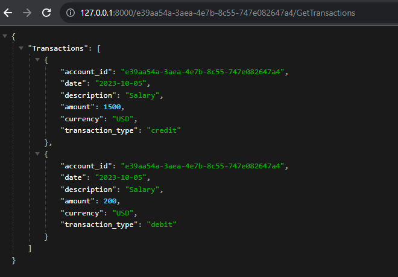

## Prerequisites 
Installation packages:
```shell
pip install -r requirements.txt
```

## Run the Bank Application

```sh
uvicorn main:app --reload
```

## API Endpoints

Access http://127.0.0.1:8000 to hit endpoints

## API Usage

### Create Account

To create a new account:

Endpoint: `/CreateAccount`
Method: `POST`
Parameters:
- `account_type`: (string) Type of account (e.g., "debit" or "credit").
- `credit_limit`: (float, optional) Specify a credit limit if the account is of type "Credit". Default is 0.0.

Example:

```shell
curl -X 'POST' \
  'http://127.0.0.1:8000/CreateAccount?account_type=Credit&credit_limit=5000' \
  -H 'accept: application/json'
```

### Process Transaction

To process a transaction for a specific account:

Endpoint: `/{account_id}/ProcessTransaction`
Method: `POST`
Path Params:
- `account_id`: (string) The unique identifier for the account.
Body:
- A JSON object representing the transaction.

Example:

```shell
curl -X 'POST' \
  'http://127.0.0.1:8000/{account_id}/ProcessTransaction' \
  -H 'accept: application/json' \
  -H 'Content-Type: application/json' \
  -d '{
    "account_id": {account_id}
    "date": "2023-10-05",
    "description": "Salary",
    "amount": 1500.0,
    "currency": "USD"
    "transaction_type": "credit"
  }'
```

### Get Balance

To retrieve the current balance of a specific account:

Endpoint: `/{account_id}/GetBalance`
Method: `GET`
Path Params:
- `account_id`: (string) The unique identifier for the account.

Example:

```shell
curl -X 'GET' \
  'http://127.0.0.1:8000/{account_id}/GetBalance' \
  -H 'accept: application/json'
```


### Get Transactions

To retrieve all transactions of a specific account:

Endpoint: `/{account_id}/GetTransactions`
Method: `GET`
Path Params:
- `account_id`: (string) The unique identifier for the account.



Example:

```shell
curl -X 'GET' \
  'http://127.0.0.1:8000/{account_id}/GetTransactions' \
  -H 'accept: application/json'
```

